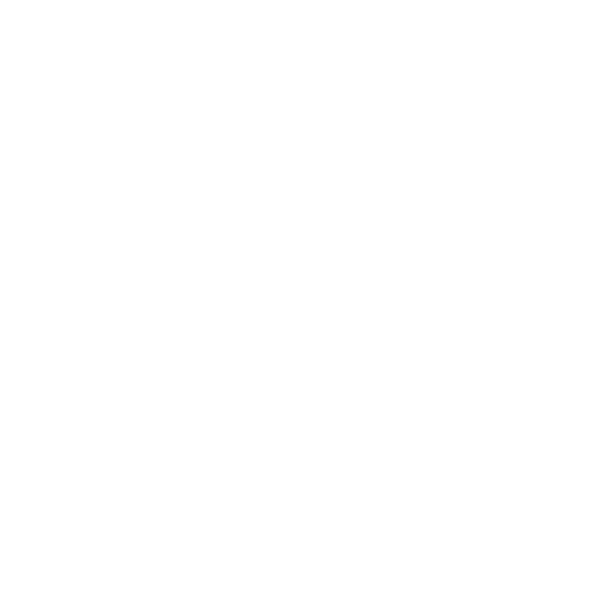

# NFT Dashboard



NFT Dashboard is a website to watch the nft market, create your own nft collections and mint them and display your nfts from your wallet.

## Get Started

Start the frontend with this command in the **frontend** directory:

```shell
npm run dev
```

Start the backend with this command the **backend** directory:

```shell
node index.js
```

Now you could view the dashboard at [localhost:3000](localhost:3000).
